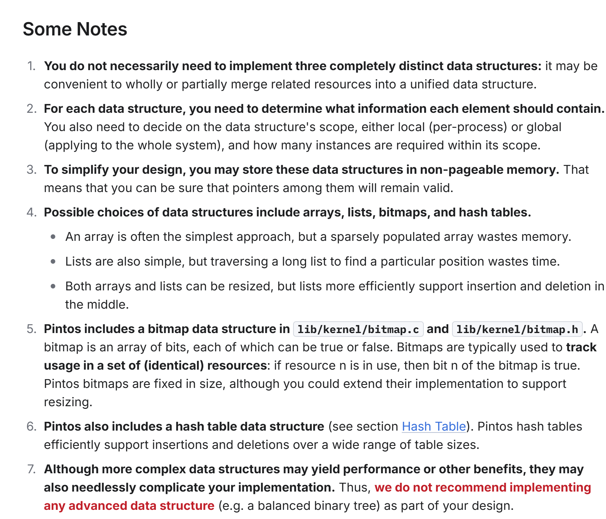

# Pintos Lab3A Outline

## 1. Environment & Source Files
*   **工作目录**：`vm/`。
*   **编译宏**：开启 `-DVM` 选项。
*   **新增关键文件**：
    *   `devices/block.h` & `devices/block.c`：用于扇区级别的块设备访问（主要用于交换分区 Swap Partition）。
*   **已有代码重用**：在 `userprog/` 和 `threads/` 基础上进行扩展。

## 2. Terminology
### 2.1 页面 (Pages - 虚拟内存)
*   **定义**：4,096 字节（4KB）的连续虚拟内存区域。
*   **对齐**：起始地址能被 4096 整除。
*   **地址结构(32 bit)**：
    * 32 位地址 = 20 位Page Number + 12 位Offset。
    * 2^12 = 4KB = 4096, 2^20=1MB, 即4GB的虚拟地址空间被划分成1M个4KB页, offset覆盖一个页内的4096个字节
*   **区分**：
    *   user page：`PHYS_BASE` (0xc0000000) 以下。
        * 用户空间（User Space）：虚拟地址在 0x00000000 到 0xBFFFFFFF（0～3 GB − 1）之间。
        * 内核空间（Kernel Space）：虚拟地址在 0xC0000000 到 0xFFFFFFFF（3 GB～4 GB − 1）之间。
        * 也就是说，整个 4 GB 虚拟地址空间被分为 用户占 3 GB，内核占 1 GB。
    *   kernel page：全局共享。内核可访问所有页，用户只能访问自己的页。
* **Useful Functions**: APPENDIX -> Code Guide -> Virtual Address


### 2.2 帧 (Frames - 物理内存)
*   **定义**：4,096 字节, continuous region of physical memory
*   **地址结构**：20 位Frame Number + 12 位Offset。
*   **映射机制**：Pintos 把**kernel**虚拟地址直接映射到物理地址来访问帧。

### 2.3 页表 (Page Tables)
*   **作用**：CPU 用的数据结构，translate from page -> frame.
```ascii
                          +----------+
         .--------------->|Page Table|---------.
        /                 +----------+          |
   31   |   12 11    0                    31    V   12 11    0
  +-----------+-------+                  +------------+-------+
  |  Page Nr  |  Ofs  |                  |  Frame Nr  |  Ofs  |
  +-----------+-------+                  +------------+-------+
   Virt Addr      |                       Phys Addr       ^
                   \_____________________________________/
```
*   **code**：`pagedir.c`。

### 2.4 交换槽 (Swap Slots)
*   **定义**：a continuous, page-size region of disk space in the swap partition. 建议页对齐。

## 3. Resource Management Overview
我需要设计以下三种核心数据结构:

### 3.1 Supplemental Page Table, SPT

supplements the page table with additional data about each page.

**作用**：
- **page fault**：kernel查SPT得知virtual page需要的数据在哪里.
    
```markdown
        CPU: 访问虚拟地址VA, 但是页表项说它不在物理内存里.page fault,陷入内核.
        kernel: 用这个缺页的VA,查SPT:
            索引-VA
            内容-数据来源+元数据(prog.exe,偏移量0x100)
```

- **资源释放**：进程终止时，kernel问SPT释放哪些资源。

**Design**：
*   范围：通常为**每个进程一个**（Local）。
*   organization：段（Segments）/页（Pages）。
*   实现建议：哈希表（Hash Table）。


**Page Fault Handler:**
lab2: page fault=bug; lab3:page fault=needs bring in page from a file / swap

- Locate the page's data by SPT (in file sys/swap slot/0-page)
    - 全零页:写时复制的思想
    - invalid access: terminate process & free all resource
- Obtain a frame
- data -> frame
- faulted VA's PTE -> frame

\* sharing


### 3.2 帧表 (Frame Table) ???不懂

by deepseek:
```text
┌─────────────────────────────────────────────────────────────────────────────┐
│                           虚拟内存管理的三角架构                              │
└─────────────────────────────────────────────────────────────────────────────┘

  用户进程的视角                  内核的管理视角                   物理硬件视角
 (Virtual Address)             (Data Structures)              (Physical Memory)
┌───────────┐              ┌─────────────────────┐           ┌───────────────┐
│ 虚拟页 #A │──────────────►  补充页表 (SPT)      │           │               │
│ (缺页中断) │              │  页 #A 应包含：     │           │               │
└───────────┘              │   文件 prog.exe     │           │  Kernel Pool  │
                           │   偏移 0x1000       │           │  (内核专用)    │
                           └──────────┬──────────┘           │               │
                                      │分配物理页             │               │
                                      ▼                      │               │
┌───────────┐              ┌─────────────────────┐           ├───────────────┤
│ 虚拟页 #B │◄───────────── │    帧表 (FT)        │◄─────────►│  User Pool    │
│ (已映射)  │    (指向)     │                     │ (占用/空闲)│  (用户页面)    │
└─────┬─────┘              │ 帧 #0: 空闲          │           │               │
      │                    │ 帧 #1: 占用 ← 页 #B  │           │  ┌─帧 #1────┐ │
      │                    │ 帧 #2: 占用 ← 页 #A  │           │  │ 数据...  │ │
      │                    └─────────────────────┘           │  ├──────────┤ │
      │                                                      │  │ 帧 #4────│ │
      │                                                      │  │(空闲)    │ │
      │              ┌─────────────────────┐                 │  └──────────┘ │
      └──────────────►   硬件页表 (PT)      │                 └───────────────┘
                     │                     │
                     │ 页 #A: 不存在        │
                     │ 页 #B: 存在 → 帧 #1  │
                     └─────────────────────┘
```

*   记录每个物理帧的使用情况(是否被占用、被哪个进程的哪个页占用)
    entry - a ptr to the page 
*   **核心功能**：支持Eviction Policy (when no frame is free)
*   **内存分配**：必须使用 `palloc_get_page(PAL_USER)` 从用户池分配, avoid allocating from the "kernel pool"!

**Key Operation: Obtain an unused frame**
- has free frame:^~^
- no free frame:
    - evict
    - [x]evict && [x]swap full: KERNEL PANIC

**Eviction**
- choose a victim: *page replacement alg.*
- remove refs
- write to fs/swap

**Accessed & Dirty Bit** for alg.
- r/w : accessed bit=1
- w: dirty bit=1
- CPU never reset to 0. Kernel may.
- **别名alias**: 2 pages -> 1 frame, 只更新一个page的bit

别名导致的状态不同步问题:
```
场景： 假设物理内存地址 0x123。
- 用户进程通过虚拟地址 U_vaddr 访问它。
- 内核通过虚拟地址 K_vaddr 访问它。
问题： 如果内核通过 K_vaddr 修改了内存（即发生了写入），CPU 的硬件逻辑只会将 K_vaddr 对应页表项的 Dirty bit 置为 1。用户态那一侧的页表项（U_vaddr 的 PTE）依然显示为 Dirty=0。
```
Pintos解决方案:
- a. 手动同步
- b. 只用一个统一的访问入口


### 3.3 交换表 (Swap Table)

tracks in-use and free swap slots.
- pick an unused swap slot: frame --evicted page-->swap partition
- free a swap slot: page read back/*process* of the swapped page terminates

use `BLOCK_SWAP`  block device
- vm/build directory, `pintos-mkdisk swap.dsk --swap-size=n` to create an disk named swap.dsk that contains a n-MB swap partition.

Lazy.(not *reserved* for any page)


## Notes


---

# Lab3B Outline

## Stack Growth
Whether a page_fault is a legal stack growth:
```c
fault_addr < PHYS_BASE
&& fault_addr >= user_esp - 32
&& fault_addr >= PHYS_BASE - STACK_LIMIT
```

- Distinguish stack accesses. Allocate additional pages only if they "appear" to be stack accesses.
- Obtain the current value of user program's stack ptr. `esp` in `struct intr_frame`, in`syscall_handler` and `page_fault()`
- Limit stack size 8MB
- First stack page not loaded lazily
- Stack pages ARE eviction candidates, written to SWAP.

\* `PHYS_BASE`:  Pintos 里用户虚拟地址空间和内核虚拟地址空间的分界线.
```c
#define PHYS_BASE ((void *) 0xc0000000)
```