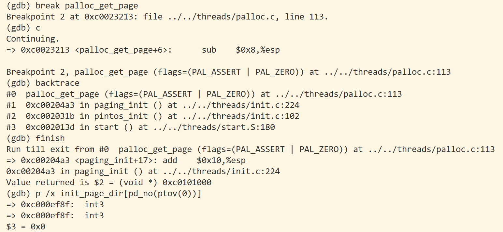
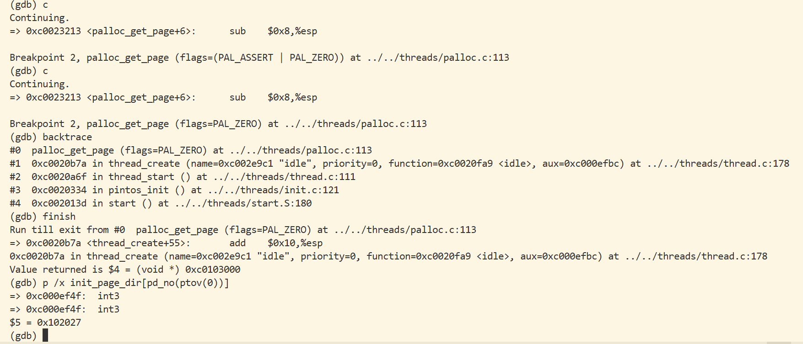
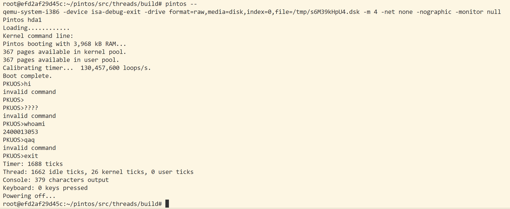

# Project 0: Getting Real

## Preliminaries

>Fill in your name and email address.

Yuqi Su <iyukisu@stu.pku.edu.cn>

>If you have any preliminary comments on your submission, notes for the TAs, please give them here.


>Please cite any offline or online sources you consulted while preparing your submission, other than the Pintos documentation, course text, lecture notes, and course staff.


## Booting Pintos

>A1: Put the screenshot of Pintos running example here.


## Debugging

#### QUESTIONS: BIOS 

>B1: What is the first instruction that gets executed?

`jmp $0x3630, $0xf000e05b`


>B2: At which physical address is this instruction located?

```
0xffff0 
((0xf000 << 4) + 0xfff0)
```


#### QUESTIONS: BOOTLOADER

>B3: How does the bootloader read disk sectors? In particular, what BIOS interrupt is used?
* By calling `read_sector` function.
* BIO interrupt: `int $0x13(0x7d1f)`.


>B4: How does the bootloader decides whether it successfully finds the Pintos kernel?

In `check_partition`, the bootloader checks:
- whether it is a Pintos kernel: `cmpb $0x20, %es:4(%si)`
- whether it is a bootable kernel: `cmpb $0x80, %es:(%si)`
If both satisfied, bootloader thinks it finds the Pintos kernel.

>B5: What happens when the bootloader could not find the Pintos kernel?

It jumps to label `no_boot_partition`
- puts("Not found.")
- Notify BIOS has failed: `int $0x18`


>B6: At what point and how exactly does the bootloader transfer control to the Pintos kernel?

- Timing: This occurs at the end of the `load_kernel`, once all kernel sectors have been successfully read into memory.

- Mechanism: 
    - The bootloader retrieves the kernel's entry point address from the ELF header and stores it in the memory location labeled `start`. 
    - executes `ljmp *start`. This action sets the CPU's instruction pointer to the kernel's entry point, transferring control to the Pintos kernel.


#### QUESTIONS: KERNEL

>B7: At the entry of pintos_init(), what is the value of expression `init_page_dir[pd_no(ptov(0))]` in hexadecimal format?

`0x0`


>B8: When `palloc_get_page()` is called for the first time,

>> B8.1 what does the call stack look like?
>> 
>> `0# palloc_get_page`
>> `1# paging_init`
>> `2# pintos_init`
>> `3# start`

>> B8.2 what is the return value in hexadecimal format?
>> 
>>`0xc0101000`
>> 

>> B8.3 what is the value of expression `init_page_dir[pd_no(ptov(0))]` in hexadecimal format?
>> 
>>`0x0`
>> 



>B9: When palloc_get_page() is called for the third time,

>> B9.1 what does the call stack look like?
>>start()-pintos_init()-thread_start()-thread_create()-palloc_get_page()
>>
>> `0# palloc_get_page`
>> `1# thread_createe`
>> `2# thread_start`
>> `3# pintos_init`
>> `4# start`

>> B9.2 what is the return value in hexadecimal format?
>> 
>>`0xc0103000`
>> 

>> B9.3 what is the value of expression `init_page_dir[pd_no(ptov(0))]` in hexadecimal format?
>> 
>>`0x102027`
>> 



## Kernel Monitor

>C1: Put the screenshot of your kernel monitor running example here. (It should show how your kernel shell respond to `whoami`, `exit`, and `other input`.)



>C2: Explain how you read and write to the console for the kernel monitor.

*   **Output:** I implemented the `tiny_shell` using `printf()` for output. `printf()` is a standard Pintos library function that eventually invokes low-level output routines (`vga_putc` and `serial_putc`) to display characters on the VGA screen and the serial port, respectively.

 *   **Input:** I used `input_getc()` from `devices/input.h` to read user input. This function fetches characters from a synchronized circular **buffer**. This buffer is populated asynchronously by the keyboard **interrupt handler** (`kbd_interrupt` in `devices/kbd.c`), which captures scan codes from hardware interrupts and translates them into ASCII characters. `input_getc()` blocks the execution until a character is available in the buffer.

